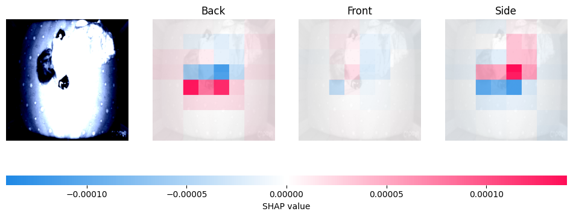
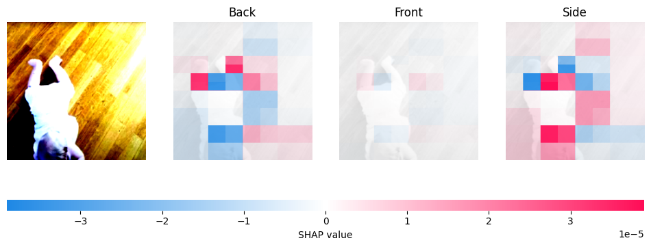
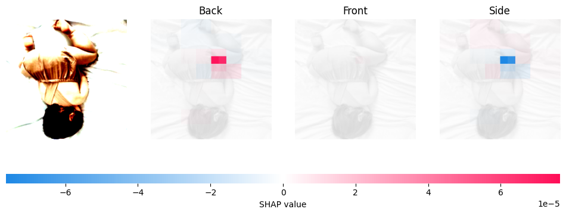
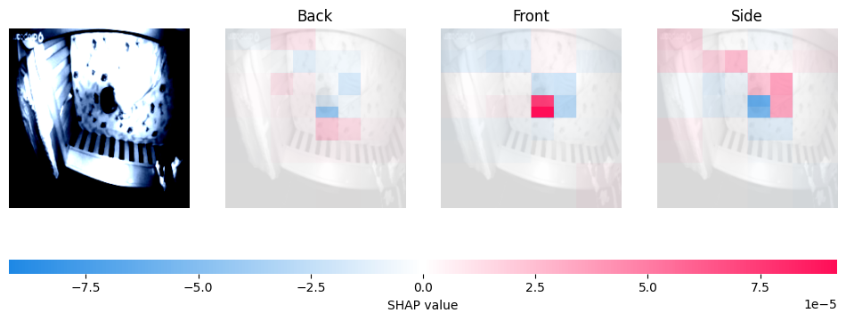
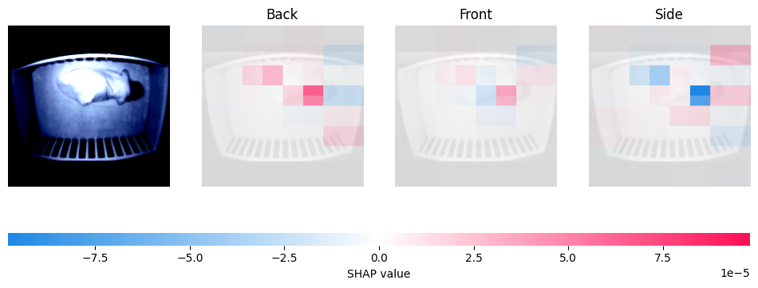
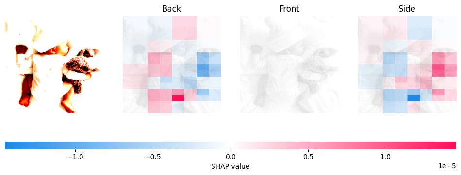
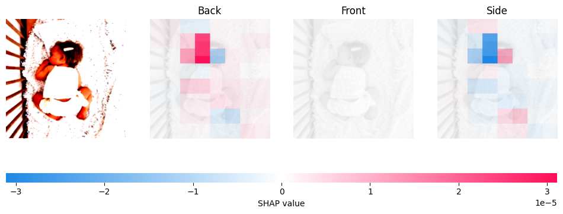
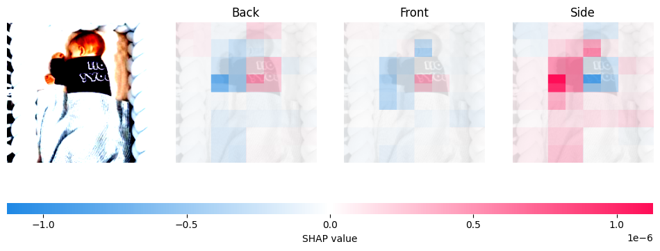
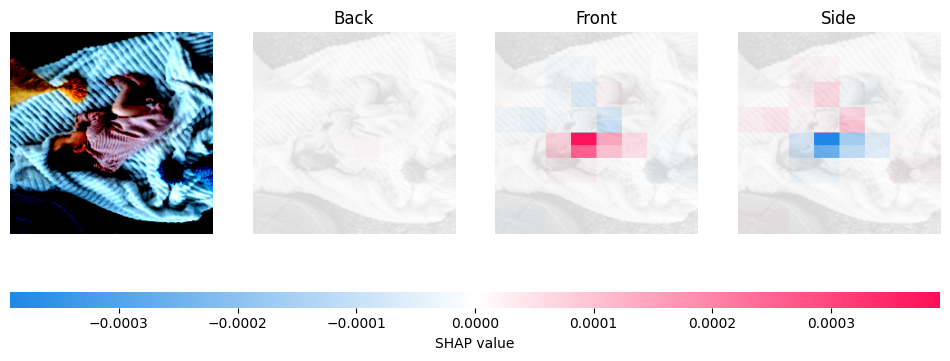

# ResNet50 explain

- 가장 높은 성능을 보이는 V5 모델의 2종 오류 원인 분석

# Partition Explainer

## 마스커 선택
- blur(3,3) : 작은 블러 효과, 국소적 특징 확인
- inpaint_telea : 픽셀 제거 후 모델 반응 확인
- inpaint_ns : telea보다 부드러운 복원

> inpaint_telea - SHAP value가 매우 낮게 측정되어 변별력이 떨어지는 현상

> inpaint_ns - inpaint_telea보다 특징 반영

> blur(3, 3) - 국소적인 특징 확인 가능, 직관적 분석이 가능할 것으로 보임

## blur(3, 3) 마스커를 활용한 오분류 데이터 탐색
- 위험 상황(Back)을 안전 상황(Front, Side)으로 분류한 2종오류의 원인을 분석

### 1. Back을 Front로 오분류

> 등 부분을 Back으로 파악하나 다리와 일부 배경의 패턴이 Front 특징으로 작용

> 머리 일부분이 Front의 특징으로 작용 
특징을 못 잡아내고 있는 것으로 보아 아기의 형체를 잘 인식하지 못하는 것으로 보임

> 맨살이 드러난 다리 부분이 Front의 특징으로 작용

> 몸 전체가 Front의 특징으로 작용 하였으며 특히 머리와 다리의 영향이 큼 
낮은 화질로 인하여 밝은 머리카락 색상을 가진 아기의 머리를 얼굴로 인식한 것으로 보임

> 몸 부분을 Back으로 인식하였으나 영향이 약하고 머리 부분이 Front의 결정적인 특징으로 작용함 
눈에 띄는 귀를 이목구비 중 하나로 인식한 것으로 추정

> Back으로 정상 분류 되었으나 상당부분이 Front의 특징으로 작용 
등이 Back의 결정적 특징으로 작용함을 확인할 수 있음

> 등을 비롯한 몸 부분이 Front의 특징으로 작용 
바로 누운 등 부분을 Back의 특징으로 잡는 일반적인 경우와 반대되는 사례이다. 
옷을 입지 않은 사진이기 때문인 것으로 보이며, 다리를 Front의 특징으로 인식하는 앞선 사례들을 참고하였을 때, 맨살이 드러난 부분을 Front의 특징으로 파악하는 것으로 보인다.

> 맨살이 조금 드러난 발목과 팔 부분을 Back의 특징으로 인식하고 있다. 
아기의 상체와 침구가 만나는 부분 또한 Front의 강한 특징으로 작용하는 특이사항이 존재한다. 

> Front로 예측된 사진으로, 낮은 조도와 한정된 시야로 인해 아기의 방향과 형체를 분명하게 인식하지 못하는 것으로 보인다.

> 배경 특징의 비중이 큰큰 것을 보아 역시 아기를 정확히 인식하지 못하는 것으로 보인다. 
실제 사용시 최대한 아기가 똑바로 보일 수 있도록 카메라의 설치 방향이 중요할 것으로 보인다.

### 2. Back을 Side로 오분류

> 낮은 화질로 아기의 형체를 잘 인식하지 못하는 것으로 보임 

> 배경에서 많은 특징을 잡아내고 있음 
배경을 아기의 신체적 패턴으로 인식하는 것으로 추정

> 상체 부분에서 특징을 인식하지 못하며 다리와 배경에서 특징을 잡아내고 있다. 
아기와 배경이 구분이 되지 않는 경우 Side로 오분류되는 경향성이 있는 것으로 보인다.

> 마찬가지로 배경에서 Side의 특징을 인식하는 사례들

> 인형과 아기의 옆모습이 Side의 특징으로 작용하였다. 
특히 인형의 작용이 큰 것을 볼 수 있다.

> 정면으로 보이는 귀가 Side의 강한 특징으로 작용하였다. 
데이터의 라벨은 Back이나 옆모습으로도 볼 수 있기 때문에 완전한 오분류는 아니다. 
그러나 다른 케이스와 마찬가지로 신체와 무관한 배경이 특징으로 작용하는 현상에 주목할 필요가 있다.

> 육안으로 판단하여도 Side라고 판단할 수 있기 때문에 오분류라고 볼 수 없다. 
아기 얼굴의 옆모습과 귀, 한 쪽으로 모인 팔 등이 Side의 특징으로 잘 작용하였다. 
라벨링 오류로 판단하는 것을 고려

> 배경의 많은 부분이 Side의 특징으로 작용하고 있다. 
특이하게도 얼굴 옆모습과 등과 같은 Side, Back의 특징이 Front의 특징으로 작용하고 있다. 
아기의 신체적 특징을 정확히 인식하지 못하는 것으로 보인다.

# 주요 인사이트

1. 카메라 각도 및 아기 자세의 중요성 확인
    - 분석 결과 카메라의 각도가 뒤집혀 있거나 아기의 방향이 반대로 촬영되는 경우 정확도가 급감하는 것을 알 수 있다.

2. 배경과 아기의 구분이 불명확
    - 여러 사례에서 배경 패턴이 특징으로 작용하는 경우를 확인하였다. 특히 배경에서 Side의 특징이 많이 인식되는 현상을 발견하였다.

3. 조도의 문제 확인
    - 낮은 조도 혹은 야간 모드의 경우 배경 특징을 잡아내는 2번 현상 발생 빈도가 높아 정확도가 감소하는 것을 확인하였다.

4. 해상도 문제 확인
    - 낮은 해상도의 경우 정확도가 급감하는 현상을 확인하였다.
    - 서비스 동영상의 품질이 중요함을 알 수 있다.

4. 라벨링 오류의 가능성
    - 실제 라벨이 Back이지만 Side로 분류해도 적절하다고 판단하는 데이터들이 존재한다.
    - 노이즈로 작용할 수 있어 검토가 필요하다.

5. 신체 특징 편향의 가능성
    - 맨살이 드러난 신체가 Front의 특징으로 작용하는 경우가 많은 것으로 보아 앞모습 데이터에 해당 특징을 가진 데이터가 편중되어 있을 수 있음을 알 수 있다.
    - 머리카락 또한 오분류의 원인이 되고 있다. 특정 패턴을 벗어날 경우 얼굴 혹은 다른 신체적 특징으로 오인하는 경우가 있는 것으로 보인다.
    - 각 라벨 별로 다양한 복장의 데이터를 추가학습해야할 필요가 있다.
    - 특히 다리 부분이 방향과 상관없이 Front의 특징으로 작용하는 경우가 많아 다리의 방향이 학습되어야할 필요성이 있다.

6. 귀 특징의 오분류 유발
    - 귀가 Side의 결정적인 특징으로 작용하는 경우가 많지만, 잘못된 라벨의 강한 특징으로 작용하는 예외적인 경우가 있다.
    - 추가적인 귀 데이터 학습이 필요하며 Side 라벨 품질을 높일 필요가 있다.

## 모델 개선 방안
1. 특정 신체의 데이터 다양성 증강 (다리 방향, 옷의 유무, 다양한 머리카락)
2. 배경 패턴 처리 방안 연구 (아기와 구분이 될 수 있도록)
3. LLIE 낮은 조도를 보완할 수 있는 기술 도입
4. 아기의 머리 각도를 명시적으로 추출하는 Head Pose Estimation 기법 적용을 검토
5. 이미지 해상도를 높이거나 노이즈 제거, 밝기 조정을 자동으로 수행하는 전처리 단계 추가 고려
6. Front, Side 분류시 Confidence가 낮다면 위험으로 존재하도록 Threshold 조정

## 서비스 및 배포 운영 인사이트
1. 2종 오류의 치명성을 예방하기 위해 confidence가 낮을 시 경고를 하거나 2차 확인을 하는 단계 추가 검토
2. 라벨 오류 모니터링을 통해 데이터셋 라벨 품질을 주기적으로 검증
3. 카메라 설치 가이드 안내
    - 아기가 카메라 앵글의 중심에 정방향으로 인식되도록 권장
    - 제품 사용 설명서에 설치 높이, 조명, 카메라 각도에 대한 구체적인 안내 포함
4. 다양한 동작과 자세, 상황에 대한 테스트와 피드백을 통한 업그레이드 필요

