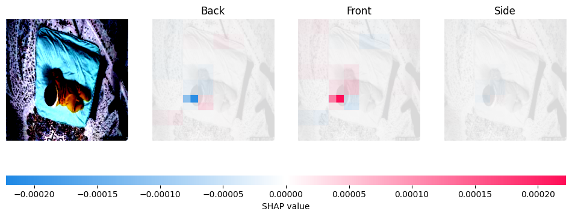

# ResNet50 explain

- 가장 높은 성능을 보이는 V5 모델의 2종 오류 원인 분석

# Partition Explainer

## 마스커 선택
- blur(3,3) : 작은 블러 효과, 국소적 특징 확인
- inpaint_telea : 픽셀 제거 후 모델 반응 확인
- inpaint_ns : telea보다 부드러운 복원

> inpaint_telea - SHAP value가 매우 낮게 측정되어 변별력이 떨어지는 현상

> inpaint_ns - inpaint_telea보다 특징 반영

> blur(3, 3) - 국소적인 특징 확인 가능, 직관적 분석이 가능할 것으로 보임

## blur(3, 3) 마스커를 활용한 오분류 데이터 탐색
### Back을 Front로 오분류
- 위험 상황을 안전 상황으로 분류한 2종 오류 이기 때문에 패턴 파악 필요

> 등 부분을 Back으로 파악하나 다리와 일부 배경의 패턴이 Front 특징으로 작용

> 머리 일부분이 Front의 특징으로 작용 
특징을 못 잡아내고 있는 것으로 보아 아기의 형체를 잘 인식하지 못하는 것으로 보임

> 맨살이 드러난 다리 부분이 Front의 특징으로 작용

> 몸 전체가 Front의 특징으로 작용 하였으며 특히 머리와 다리의 영향이 큼 
낮은 화질로 인하여 밝은 머리카락 색상을 가진 아기의 머리를 얼굴로 인식한 것으로 보임

> 몸 부분을 Back으로 인식하였으나 영향이 약하고 머리 부분이 Front의 결정적인 특징으로 작용함 
눈에 띄는 귀를 이목구비 중 하나로 인식한 것으로 추정

> Back으로 정상 분류 되었으나 상당부분이 Front의 특징으로 작용 
등이 Back의 결정적 특징으로 작용함을 확인할 수 있음

> 등을 비롯한 몸 부분이 Front의 특징으로 작용 
바로 누운 등 부분을 Back의 특징으로 잡는 일반적인 경우와 반대되는 사례이다. 
옷을 입지 않은 사진이기 때문인 것으로 보이며, 다리를 Front의 특징으로 인식하는 앞선 사례들을 참고하였을 때, 맨살이 드러난 부분을 Front의 특징으로 파악하는 것으로 보인다.

> 해당 사례 또한 맨살이 조금 드러난 발목과 팔 부분을 Front의 결정적인 특징으로 인식하고 있다. 
옷을 입고 있는 등은 Back의 특징으로 잘 파악하는 것을 확인할 수 있다. 
아기의 상체와 침구가 만나는 부분 또한 Front의 강한 특징으로 작용하는 특이사항이 존재한다. 

> Front로 예측된 사진으로, 낮은 조도와 한정된 시야로 인해 아기의 방향과 형체를 분명하게 인식하지 못하는 것으로 보인다.

> 배경 특징의 비중이 큰큰 것을 보아 역시 아기를 정확히 인식하지 못하는 것으로 보인다. 
실제 사용시 최대한 아기가 똑바로 보일 수 있도록 카메라의 설치 방향이 중요할 것으로 보인다.

### Back을 Side로 오분류

