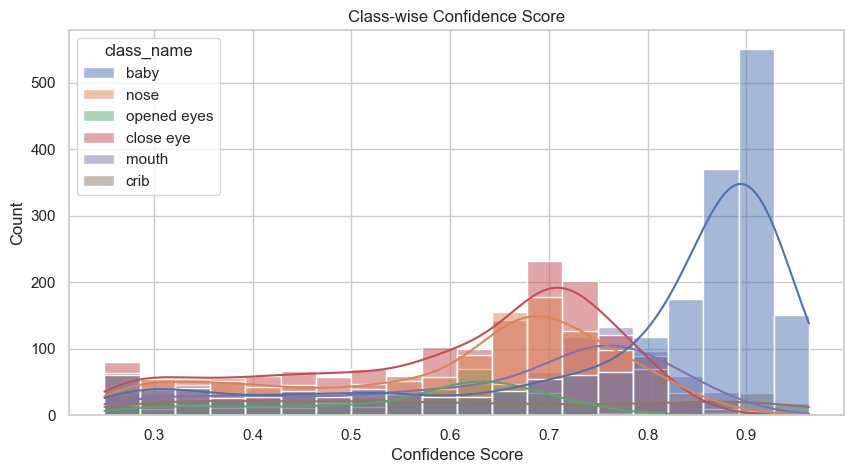

# YOLOv8 Explain
- 현재 시스템은 코와 입이 감지되 않으면 질식 위험 알림을 보내는 구조로 설계됨
- 미감지가 자주 발생하여 "거짓 위험 알림"이 잦아지면 사용자 스트레스가 증가하고, 신뢰도가 저하될 우려가 있음
- 장기적인 시스템 신뢰도로 인하여 실제 위험 시 대응이 늦어질 수 있는 문제 존재
- ResNet50이 Back을 분류하지 못하는 2종 오류만큼 치명적이지는 않지만, 서비스 신뢰성과 사용자 경험을 고려하여 반드시 해결해야 할 문제임

# ResNet50 Train Set 사용 클래스별 Confidence 분포 분석

- ResNet50 의 학습데이터 중 "Front", "Side" 클래스에 해당하는 데이터 전체를 할용하여 YOLOv8 모델의 객체별 Confidence 분포를 분석
- "baby" 클래스의 Confidence 값은 0.8 - 0.9 중앙값 약 0.85 - 0.9로, 높음
- "nose", "mouth" 클래스의 중앙값 0.6 - 0.7
- "nose"의 IQR 범위가 0.5 부근까지 아래로 치우친 편 
    - confidence 임계치를 0.5로 설정하여도 미감지 가능성 

# Validation Set 사용 클래스별 IOU(Intersection over Union) 분포 분석

- "nose"와 "mouth"의 중앙값 0.8정도
- IQR 범위 또한 0.7 이상으로 Confidence에 비해 높은 수준
- 그러나 0.5 이하의 이상치가 존재하는 것을 통해 감지하지 못하는 특이 조건이 있음을 알 수 있음
    - 낮은 화질과 조도, 옆모습, 아기가 정방향이 아닌 경우 등으로 추정 

# Grad-CAM 분석

